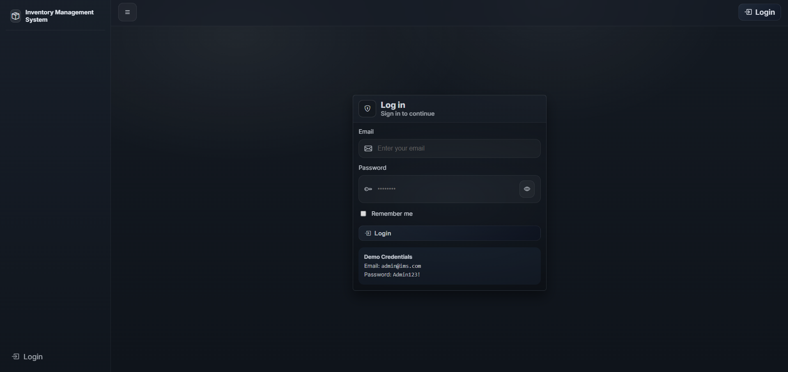
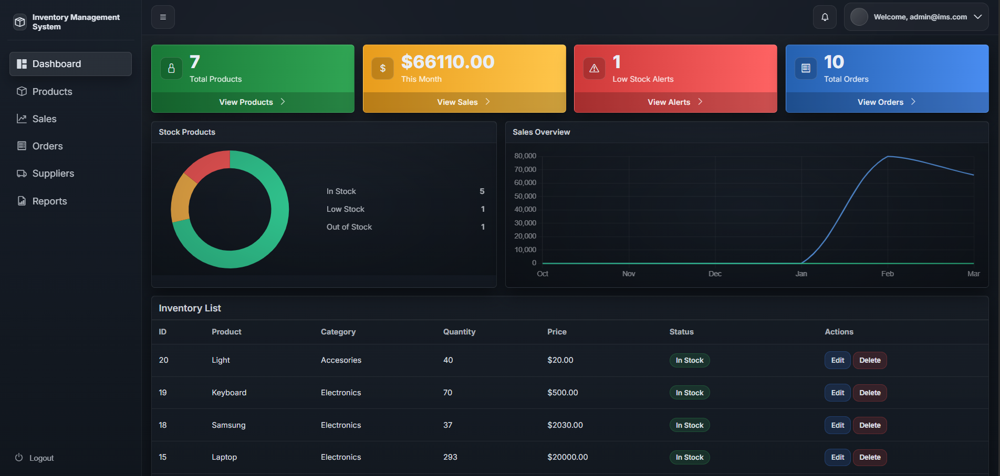
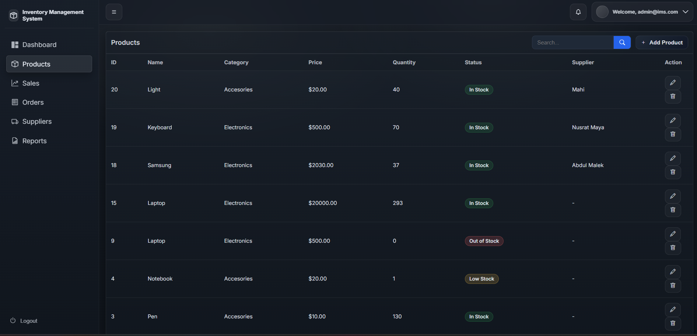
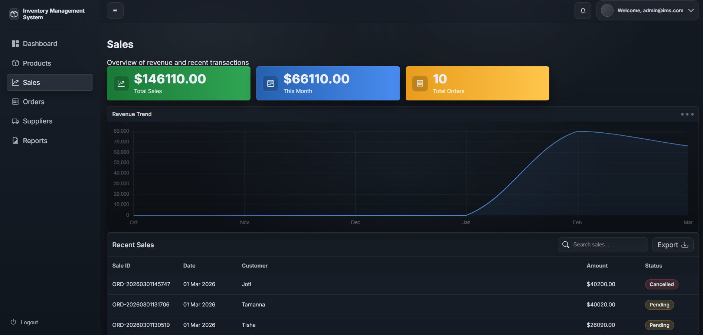
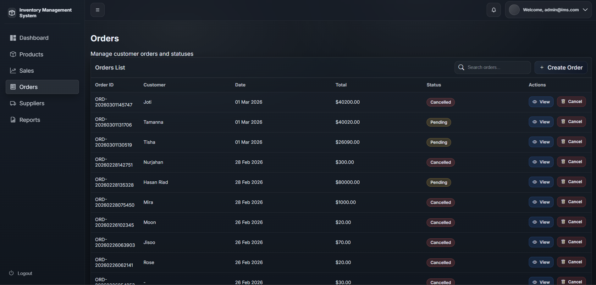
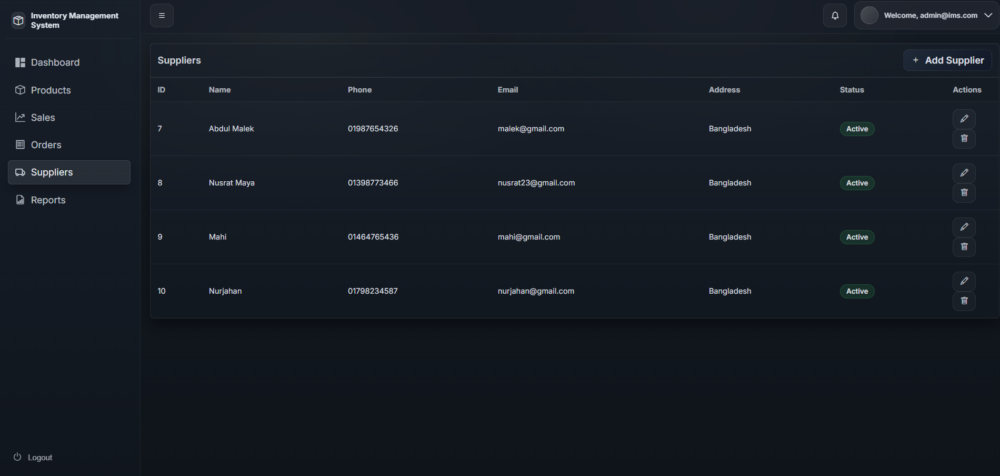
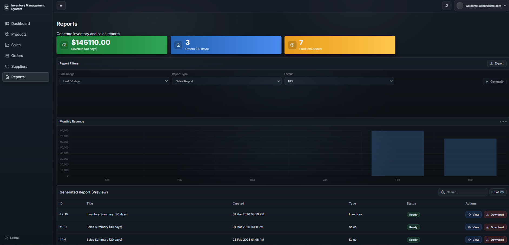

# 📦 InventoryManagementPro

A full-featured **Inventory Management System** built using **ASP.NET Core MVC (.NET 8)** and **Entity Framework Core**, featuring role-based authentication and a dynamic analytics dashboard.

---

## 🚀 Project Overview

InventoryManagementPro is a structured, production-ready inventory system designed to manage:

- Products  
- Suppliers  
- Orders  
- Sales  
- Stock updates  
- Dashboard analytics  

The system follows clean architecture principles:

Controller → Service Layer → Data Layer 

---

## ✨ Features

### 🔐 Authentication & Authorization
- ASP.NET Core Identity
- Role-based access control (Admin / Staff)
- Secure login system
- `[Authorize]` implementation
- Seeder-based demo accounts

### 📦 Product Management
- Full CRUD operations
- Category support
- Reorder level tracking
- Stock status logic (In Stock / Low Stock / Out of Stock)
- Search & filtering support

### 🚚 Supplier Management
- Supplier CRUD operations
- Product ↔ Supplier relationship binding

### 🧾 Orders System
- Create orders with multiple items
- Automatic stock deduction
- Order history tracking
- Dynamic calculations

### 📊 Dynamic Dashboard
- Total Products
- Total Orders
- Low Stock Alerts
- Revenue summary
- Chart.js integration
- Optimized EF Core queries

### 📄 Reports
- Sales report
- Order details report
- Filter & search support

---

## 🛠 Tech Stack

- **Backend:** ASP.NET Core MVC (.NET 8)  
- **Database:** SQL Server  
- **ORM:** Entity Framework Core  
- **Authentication:** ASP.NET Core Identity  
- **Frontend:** Bootstrap 5  
- **Charts:** Chart.js  
- **Version Control:** Git & GitHub  

---

## 📂 Project Structure

```
InventoryManagementPro/
│
├── Controllers/
│   ├── DashboardController.cs
│   ├── ProductsController.cs
│   ├── OrdersController.cs
│   ├── SuppliersController.cs
│   ├── SalesController.cs
│   └── ReportsController.cs
│
├── Models/
│   ├── Product.cs
│   ├── Order.cs
│   ├── OrderItem.cs
│   ├── Supplier.cs
│   └── ViewModels/
│       ├── DashboardVM.cs
│       ├── SalesVM.cs
│       └── LoginVM.cs
│
├── Data/
│   ├── AppDbContext.cs
│   └── IdentitySeeder.cs
│
├── Views/
│   ├── Dashboard/
│   ├── Products/
│   ├── Orders/
│   ├── Suppliers/
│   ├── Sales/
│   ├── Reports/
│   └── Account/
│
├── wwwroot/
│   ├── css/
│   ├── js/
│   ├── images/
│   └── lib/
│
├── screenshots/
│   ├── login.png
│   ├── dashboard.png
│   ├── products.png
│   ├── orders.png
│   ├── suppliers.png
│   ├── sales.png
│   └── reports.png
│
├── appsettings.json
├── appsettings.Development.json
├── InventoryManagementPro.csproj
├── Program.cs
└── README.md
```
---
## 💻 How to Run Locally
Follow the steps below to run this project on your local machine.
1️⃣ Clone the Repository
```
git clone https://github.com/offbyone-dev/InventoryManagementPro.git
```
2️⃣ Navigate into the Project Folder
```
cd InventoryManagementPro
```
3️⃣ Configure Database Connection
Open the file:
```
appsettings.json
```
Update the connection string according to your SQL Server setup.
Example:
```
"ConnectionStrings": {
  "DefaultConnection": "Server=localhost\\SQLEXPRESS;Database=InventoryManagementProDb;Trusted_Connection=True;TrustServerCertificate=True;"
}
```
4️⃣ Apply Database Migrations
Make sure SQL Server is running, then execute:
```
dotnet ef database update
```
5️⃣ Run the Application
```
dotnet run
```
The application will start locally :
```
https://localhost:7075
```
---
## 🔑 Demo Credentials

### 👑 Admin
- Email: `admin@ims.com`
- Password: `Admin123!`

### 👩‍💼 Staff
- Email: `staff@ims.com`
- Password: `Staff123!`

Seeder enabled for demo accounts.

---
## 📷 Screenshots

### 🔐 Login Page


---

### 📊 Dashboard


---

### 📦 Products Page


---
### 🚚 Suppliers Page


---

### 🧾 Orders Page


---

### 🚚 Suppliers Page


---

### 📄 Reports Page


---
## 🎥 Project Demo
Watch Full Demo Video:
👉 https://youtu.be/EuDRAowlD7A
---
## 🌐 Deployment
The project is deployment-ready.
Due to temporary hosting limitations, a public live demo is not currently available.
Cloud deployment (Azure) will be added in a future update.
